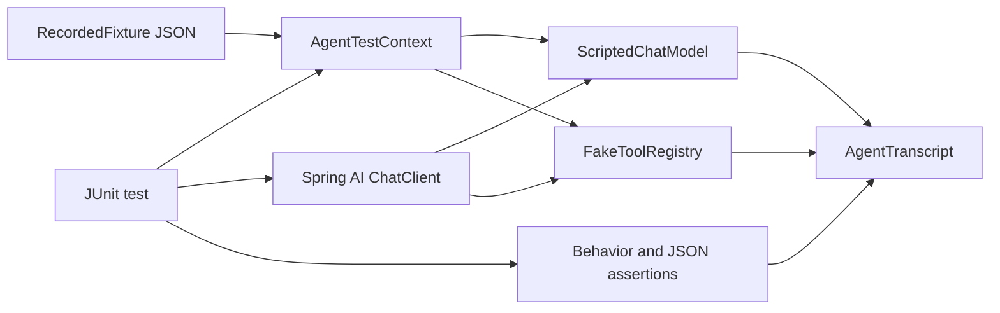
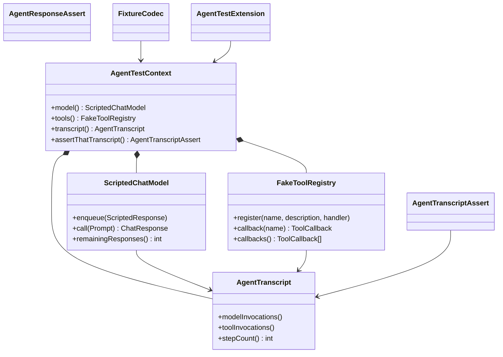
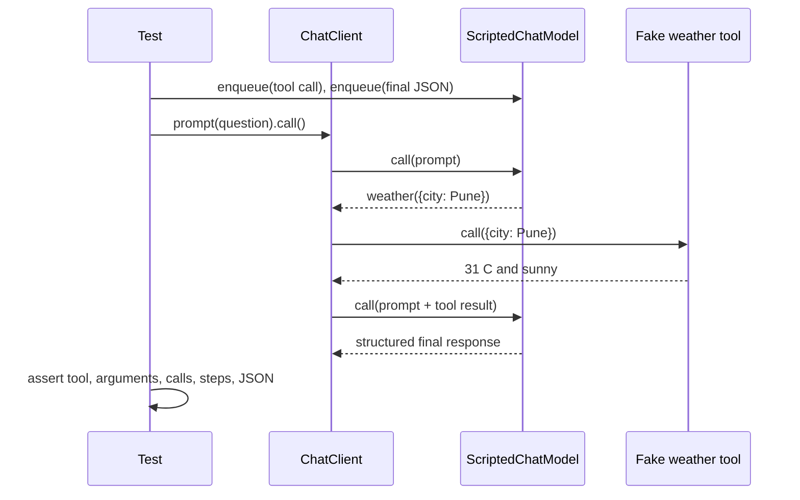

# Spring AI Agent Testkit

JUnit 5 testing utilities for deterministic Spring AI agents, tool calls, and structured outputs.

## Problem Statement

Agent tests become slow, costly, and unreliable when they depend on a live model. Plain response stubs also miss the behavior that matters: which tools ran, with what arguments, and how many model or tool steps the agent needed.

## What This Project Solves

The testkit supplies a scripted Spring AI `ChatModel`, recording fake tools, behavioral assertions, JSON response assertions, versioned fixtures, a JUnit extension, and explicit Spring Boot test auto-configuration. Tests exercise Spring AI's real `ChatClient` tool-calling loop without network access or an API key.

## When To Use It

Use the testkit for Java services that need to verify agent orchestration, tool selection, tool arguments, structured output, step budgets, or provider failure handling. It is designed for test scope and deterministic CI runs.

## Architecture / HLD



The Spring AI client remains the system under test. The testkit replaces only nondeterministic model and tool boundaries, then records their interactions for assertions.

## Detailed Design / LLD





`ScriptedChatModel` advertises `ToolCallingChatOptions`, which is required for Spring AI 2.0's `ToolCallingAdvisor` to execute callbacks. Script consumption is serialized, while transcript snapshots are safe to read across threads.

## Public API / API Structure

- `AgentTestContext`: isolated model, tool registry, and transcript for one test.
- `ScriptedChatModel` and `ScriptedResponse`: ordered text, tool-call, or failure scripting.
- `FakeToolRegistry`: named `ToolCallback` registration with input/output recording.
- `AgentTranscript`, `AgentTranscriptAssert`, and `AgentResponseAssert`: behavioral, budget, argument, and structured JSON assertions.
- `fixture.RecordedFixture` and `fixture.FixtureCodec`: versioned JSON fixture read, write, and installation.
- `junit.AgentTest` and `junit.AgentTestExtension`: per-test parameter injection.
- `spring.AutoConfigureAgentTestkit` and `spring.AgentTestkitAutoConfiguration`: explicit Spring test context import.

No HTTP endpoint or CLI is introduced because this component is a test library.

## Core Concepts

### Script responses

Each model invocation consumes exactly one scripted response. An unexpected extra invocation throws `UnscriptedModelCallException` with its call number. A scripted failure rethrows the original exception instance.

### Assert behavior, not prose

The primary assertions cover required or forbidden tools, JSON-pointer arguments, model-call counts, and total step budgets. `AgentResponseAssert` checks JSON structure without relying on exact natural-language equality.

### Recorded fixtures

Fixtures use schema version `1` and contain model replies plus deterministic tool results. An unknown schema version fails at load time rather than being interpreted silently.

## Local Prerequisites

- JDK 21 or newer
- Git
- Network access only for the first Maven dependency download

Maven is not installed globally; the checked-in Maven Wrapper downloads Maven 3.9.12. Docker and an OpenAI key are not required.

## Steps To Run Locally

```shell
git clone https://github.com/aniket-deshkar/spring-ai-agent-testkit.git
cd spring-ai-agent-testkit
./mvnw verify
```

On Windows PowerShell:

```powershell
.\mvnw.cmd verify
```

Install the snapshot into the local Maven repository when testing it from another project:

```shell
./mvnw install
```

## Configuration

The deterministic test path has no environment variables or network configuration. Add the artifact with test scope after installing or publishing it:

```xml
<dependency>
  <groupId>io.github.aniketdeshkar</groupId>
  <artifactId>spring-ai-agent-testkit</artifactId>
  <version>0.1.0</version>
  <scope>test</scope>
</dependency>
```

The library targets Java 21, Spring AI 2.0.0, Spring Boot 4.1.0, and JUnit 5.13.4. The JUnit 5 BOM is pinned because Spring Framework 7's `SpringExtension` is compiled for JUnit 6; Boot context examples therefore use `ApplicationContextRunner` while the public JUnit extension remains compatible with the required JUnit 5 line.

## Usage Examples

### JUnit extension and tool-loop test

```java
@AgentTest
class WeatherAgentTest {
    @Test
    void callsWeatherOnce(AgentTestContext context) {
        context.tools().register("weather", "Current weather by city", input -> "31 C");
        context.model()
                .enqueue(ScriptedResponse.toolCall(
                        "call-1", "weather", "{\"city\":\"Pune\"}"))
                .enqueue(ScriptedResponse.text(
                        "{\"city\":\"Pune\",\"temperature\":31}"));

        String response = ChatClient.builder(context.model())
                .defaultTools(context.tools().callback("weather"))
                .build()
                .prompt("Weather in Pune?")
                .call()
                .content();

        context.assertThatTranscript()
                .requiredTool("weather")
                .forbiddenTool("delete_account")
                .toolArgumentEquals("weather", "/city", "Pune")
                .modelCallCount(2)
                .stepsAtMost(3);
        AgentAssertions.assertThatResponse(response)
                .jsonPathEquals("/temperature", 31);
    }
}
```

### Spring Boot test context

```java
new ApplicationContextRunner()
        .withConfiguration(AutoConfigurations.of(AgentTestkitAutoConfiguration.class))
        .withUserConfiguration(MyAgentTestApplication.class)
        .run(context -> {
            AgentTestContext testkit = context.getBean(AgentTestContext.class);
            // Script and invoke application beans here.
        });
```

For a declarative Spring test import, annotate a compatible test class with `@AutoConfigureAgentTestkit`.

### Fixture loading

```java
AgentTestContext context = new AgentTestContext();
FixtureCodec fixtures = new FixtureCodec();
fixtures.install(context, fixtures.read(Path.of("src/test/resources/fixtures/weather.json")));
```

## Testing

Run the complete build:

```shell
./mvnw verify
```

The suite covers ordered and exhausted scripts, preserved provider failures, concurrent model calls, duplicate and unknown tools, required and forbidden tool assertions, JSON arguments and responses, fixture round trips and schema rejection, JUnit injection, Spring auto-configuration, and a full `ChatClient` tool loop.

CI runs the same command on Java 21 without secrets or paid services.

An optional live compatibility check is isolated behind both the `live-openai` Maven profile and `OPENAI_API_KEY`. It defaults to the handoff-specified `gpt-5.6-luna` identifier and makes no call when the key is absent:

```shell
OPENAI_API_KEY=... ./mvnw -Plive-openai verify
```

Override the model only when validating another compatible deployment:

```shell
OPENAI_API_KEY=... ./mvnw -Plive-openai -Dopenai.model=gpt-5.6-luna verify
```

## Observability

`AgentTranscript` captures model prompts and tool inputs/results in memory for assertions. The library emits no logs or external telemetry. Tests should avoid recording sensitive production prompts.

## Security Considerations

- Fake tools execute local test handlers only; they do not grant sandboxing or authorization.
- Treat recorded prompts, arguments, and tool results as potentially sensitive data.
- Do not put API keys or production transcripts in fixtures.
- The default build and example make no network or model-provider calls.

## Repository Structure

```text
src/main/java/.../agenttestkit/          Core model, tools, transcript, assertions
src/main/java/.../agenttestkit/fixture/  Versioned fixture codec
src/main/java/.../agenttestkit/junit/    JUnit extension and annotation
src/main/java/.../agenttestkit/spring/   Explicit Boot test auto-configuration
src/test/java/.../example/               Executable Spring AI tool-loop example
.github/workflows/ci.yml                 Zero-secret verification workflow
```

## Design Decisions / Trade-offs

- One test-scoped artifact keeps setup small; framework adapters depend on the same core state rather than duplicating it.
- Script exhaustion fails immediately so accidental extra model calls cannot pass unnoticed.
- Tools accept raw JSON strings because that is Spring AI's callback boundary; assertions parse them with JSON Pointer.
- Time stamps aid failure diagnosis but assertions use deterministic ordering and counts, not wall-clock values.
- The fixture schema is explicit and version-checked to prevent ambiguous replay behavior.
- No live OpenAI dependency is part of the normal build. Provider compatibility belongs in an explicitly opt-in profile and never in deterministic CI.

## Contributing

Read [CONTRIBUTING.md](CONTRIBUTING.md), add behavior-focused tests, and run `./mvnw verify` before submitting a change. Report sensitive issues using the process in [SECURITY.md](SECURITY.md).

## License

Licensed under the [Apache License 2.0](LICENSE).
